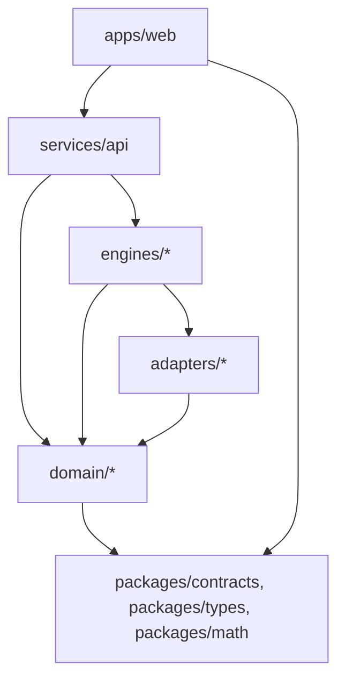

# AlignerStudio Architecture

## 1. Purpose

AlignerStudio is an orthodontic treatment-planning application. This document
describes the system architecture through Phase 10 (project foundation,
vertical slice, real segmentation architecture, geometric tooth
identification/arch analysis, deterministic setup proposals, and staged
intermediate states with geometric validation, review UI, doctor editing, and
adjunct proposals).
It will evolve as engines are implemented.

## 2. Guiding Principles

1. Clean, modular architecture with strict layer boundaries.
2. Strict separation between **domain logic**, **engines**, **adapters**,
   **UI**, and **infrastructure**.
3. No vendor- or model-specific code inside domain logic.
4. All external/open-source algorithms are isolated behind adapters that
   implement an internal interface (port/adapter pattern).
5. No giant files — split by responsibility.
6. No circular dependencies between layers (enforced by directory
   conventions and import direction described below).
7. Strong typing everywhere (TypeScript `strict`, Python type hints + Pydantic).
8. Deterministic algorithms preferred; any stochastic/ML step must be
   clearly labeled and reproducible (seeded) where possible.
9. Every engine ships with automated tests.
10. Clinical thresholds are never invented — see
    [CLINICAL_BOUNDARIES.md](CLINICAL_BOUNDARIES.md) for sourcing rules.
11. Unvalidated proposals are never represented as clinically approved
    (see `DataProvenance` in [packages/types](packages/types/src/provenance.ts)
    and [domain/case](domain/case/provenance.py)).
12. Clinical rules/config are externalized, not hard-coded.
13. Architecture allows future AI/ML models to be added as new adapters
    without touching domain or UI code.

## 3. Layers and Import Direction



Rules:

- `domain/` has **no** dependency on `engines/`, `adapters/`, `services/`, or
  `apps/`. It contains entities, value objects, and pure business rules only.
- `engines/` implement orchestration/algorithms and depend only on `domain/`
  and `adapters/` (through interfaces defined by the engine, not the vendor
  library directly).
- `adapters/` wrap a specific external library/model (MeshSegNet,
  ToothGroupNetwork, TANet, Open3D, trimesh, etc.) behind an interface
  declared in the corresponding `engines/*` package. Adapters never leak
  vendor types outward.
- `services/api` (FastAPI) exposes HTTP endpoints, translates HTTP DTOs
  (`packages/contracts`) to/from domain entities, and calls engines.
- `apps/web` (React/TypeScript/Vite) is the only UI. It talks to
  `services/api` over HTTP using shared contract types.
- `packages/contracts` holds the shared API request/response schema
  (Pydantic on the Python side, generated/mirrored TypeScript types on the
  frontend side) so both sides agree on shape and on `DataProvenance`.
- `packages/types` holds pure TypeScript domain-adjacent types used only by
  the frontend (view models, viewer-specific types).
- `packages/math` holds framework-agnostic math helpers (vectors, matrices)
  used by the Three.js viewer. No React/Three.js imports here.

## 4. Directory Map (Phase 10)

```
apps/web/            React + TS + Vite frontend and Three.js review workspace
services/api/         FastAPI backend, HTTP layer only
engines/geometry/      Mesh validation/repair (Open3D + trimesh adapters)
engines/segmentation/  Mesh preprocessing, ONNX orchestration, output parsing, extraction
engines/arrangement/   Tooth identification, coordinate systems, arch analysis
engines/planning/      Setup, staging, editing, recalculation, and adjunct proposals
engines/staging/       Deterministic intermediate stage generation
engines/validation/    Mesh proximity, contact, collision, and report engine
domain/case/           Case entity, provenance, upload metadata
domain/tooth/          Tooth entity, FDI identity, landmarks, coordinate frames
domain/movement/        Tooth movement / transform value objects (future)
domain/treatment_plan/  Setup/objective/proposal/stage entities
adapters/meshsegnet/    Adapter boundary for MeshSegNet (not integrated yet)
adapters/toothgroupnet/ Adapter boundary for ToothGroupNetwork (not integrated yet)
adapters/tanet/         Adapter boundary for TANet (not integrated yet)
packages/contracts/     Shared API schemas (Pydantic + TS types)
packages/types/         Frontend-only shared TS types
packages/math/          Frontend math helpers for the 3D viewer
assets/                 Brand assets (AlignerStudio logo, favicon, loader)
docs/                   Additional design/reference documentation
tests/python/            Cross-cutting Python integration tests
tests/ts/                Cross-cutting TypeScript tests
```

## 5. Data Provenance Model

Every piece of generated data in the system is tagged with a
`DataProvenance` value:

- `real` — measured directly from the uploaded scan (e.g., raw mesh).
- `generated` — produced by an engine/algorithm, not yet reviewed.
- `experimental` — produced by an adapter/model still under evaluation.
- `fixture` — deterministic engineering/test data; never a clinical result.
- `clinically_reviewed` — explicitly approved by a doctor in the UI.

The UI and API must never present `generated` or `experimental` data as
`clinically_reviewed`. See [CLINICAL_BOUNDARIES.md](CLINICAL_BOUNDARIES.md).

Segmentation has an additional architectural boundary: its output is
geometry-only (`ToothInstance`) and must not contain FDI labels. Tooth
identification is a separate future stage. A missing ONNX model/runtime is an
explicit error; the production path never falls back to the Phase 1 fixture.

## 6. Phase 1/3/4/5/6/7/8/9/10/11 Vertical Slice

The first implemented slice proves the pipeline shape end-to-end with
placeholders where real engines do not exist yet:

```
Create Case → Upload STL → Validate Mesh → External ONNX Segmentation
  → Geometry-only ToothInstances → Geometric Identification
  → Coordinate Frames → Descriptive Arch Analysis
  → Explicit-Objective Target Setup → Planning Proposal
  → Stage 0 → Deterministic Intermediate Stages → Final Target Stage
  → Geometric Validation Report → Stage Review Workspace
  → Doctor Edit Copy → Restage → Revalidate → Updated Review
  → IPR/Attachment Proposals → Doctor Review
  → Deterministic Engineering Export (STL + JSON/CSV + hashes + ZIP)
```

The Phase 3 segmentation pipeline is implemented around an external ONNX
adapter, but no model artifact or weights are included. The adapter parses
face labels/confidences and extracts deterministic connected mesh instances.
The legacy placeholder remains only for existing engineering fixture tests;
it is not a production fallback. See [docs/SEGMENTATION_ENGINE.md](docs/SEGMENTATION_ENGINE.md)
and [TREATMENT_PLAN.md](TREATMENT_PLAN.md).

Phase 4 keeps FDI identification separate from segmentation. The caller
supplies upper/lower arch context; deterministic principal-axis geometry rules
assign identities only for complete, unambiguous sixteen-slot arches.
Uncertain and malformed instances retain provenance and receive no guessed FDI
label. Coordinate frames and arch measurements are descriptive geometry only.

Phase 5 planning consumes only identified teeth and explicit treatment
objectives. `TreatmentPlanningEngine` creates separate immutable target scene
vertices using each tooth's coordinate system. It does not mutate source scan
geometry, infer objectives, stage movements, or claim clinical approval.
Validation ports exist for movement limits, proximity, collision, and
anatomical rules; only finite-target-geometry validation is implemented.

Phase 6 staging consumes the immutable Phase 5 source/target setup. It
interpolates all movement dimensions and vertices deterministically, preserves
coordinate systems/provenance/source relationships, and produces stable stage
and staging hashes. It does not silently modify plans or apply clinical
constraints.

Phase 7 validation consumes staged local mesh vertices/faces, applies only
caller-supplied geometric thresholds, uses AABB broad-phase filtering followed
by triangle-level distance/intersection checks, and returns deterministic
proximity, contact, collision, tooth, stage, and treatment-report models. It
never changes movements or automatically restages a plan.

Phase 8 exposes precomputed stage data through the React/Three.js review
workspace. Stage navigation selects existing staged states; the UI does not
recalculate movement. Real staged API payloads remain unavailable and are
shown as an explicit unavailable state. The local engineering preview is
fixture-labeled and cannot be mistaken for clinical output. Tooth inspection,
validation counts, camera controls, visibility toggles, and wireframe mode are
read-only review tools.

Phase 9 adds `TreatmentEditingApplication` outside React. It records explicit
doctor edits, rebuilds immutable proposal copies, preserves source geometry and
edit history, then composes staging and geometric validation for recalculation.
No automatic clinical correction is permitted.

Phase 10 adjunct proposals are tied to the current plan/version and remain
`needs_review` unless a doctor explicitly changes their status. Geometry that
cannot support a reliable measurement returns `unable_to_determine`; no
clinical threshold or automatic movement change is introduced.

Phase 11 export consumes completed immutable artifacts through
`engines/export.TreatmentExportEngine`. It validates cross-artifact IDs,
stage order, geometry correspondence, meshes, proposal references, and
provenance before serializing stage STLs and canonical reports with SHA-256
digests and a deterministic ZIP. Export never modifies planning data or
upgrades provenance/approval status. Incomplete exports require explicit
opt-in and are marked as engineering-incomplete.

## 7. Testing Strategy

- Python: `pytest` covers `domain/`, `engines/`, and `services/api` (via
  `TestClient`).
- TypeScript: `vitest` covers `packages/math` and `packages/types` helpers,
  plus component-level tests in `apps/web`.
- No engine is considered "done" without tests, even placeholder engines
  (tests assert the fixture is labeled correctly).

## 8. Tooling

- TypeScript: strict mode, ESLint, Prettier, Vitest, pnpm workspaces.
- Python: Ruff (lint + format), pytest, `uv`/`venv` for environment, FastAPI.
- Monorepo root `package.json` defines pnpm workspaces for `apps/*` and
  `packages/*`. Python packages are managed independently under a single
  virtual environment defined by `services/api/pyproject.toml` (dev
  dependencies cover `domain`, `engines`, `adapters`, `tests/python`).
