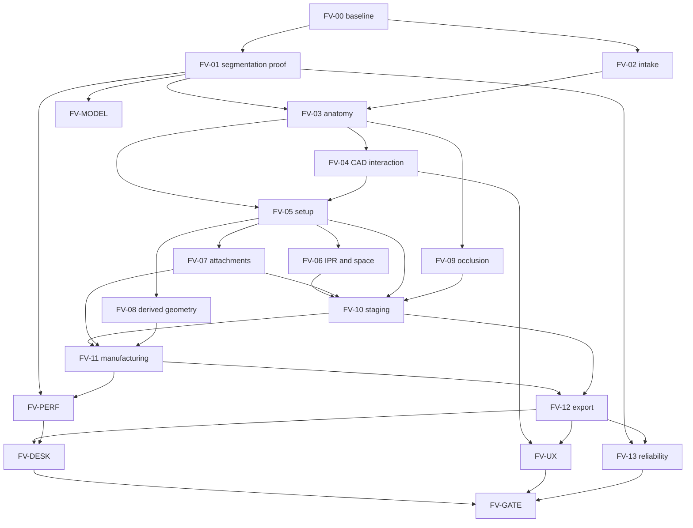

# Aligner Studio — World-Class First Version Master Plan

| | |
|---|---|
| Document ID | `AS-FV-MASTER-1.10` |
| Status | Authoritative roadmap |
| Audit date | 2026-09-26 |
| Repository | Current working tree at audit time |
| Companion | [ALIGNER_STUDIO_CAPABILITY_MATRIX.md](ALIGNER_STUDIO_CAPABILITY_MATRIX.md) |
| Product readiness | Not claimed. No capability has passed the final First Version gate. |

This document replaces every previous wave, work-package, and phase plan as the **only roadmap**. It does not delete historical implementation, tests, or reports. Those remain evidence to audit. A prior report that says PASS is not completion.

Do not continue Wave 11, Wave 12, WP-14, or WP-15. New work uses the `FV-*` phases in this document. Phase IDs here are not those old identifiers.

---

## 1. North Star

Aligner Studio is a professional dental and orthodontic CAD application for clear-aligner planning. The First Version must carry a real case from scan import through segmentation review, anatomical intelligence, target setup, staging, doctor refinement, clinical tools, occlusion when the data actually supports it, geometric validation, manufacturing preparation, export, reopen, and independent re-verification.

The product is a local, installable application a doctor can run without Cursor, with a local backend and a path to local inference. The 3D viewport is the primary workspace. Every clinically relevant object is classified by source and truth state. Models may propose. They may not silently become the plan.

Out of scope for the meaning of "done":

- A UI prototype or screenshot tour
- A demo that substitutes fixture geometry for an uploaded scan
- A collection of disconnected feature flags
- A test-passing engineering shell that cannot process a second real case
- A browser-only application with no installable delivery
- An engineering PASS presented as clinical approval

Derived geometry is legitimate CAD when it is labeled. Observed anatomy, segmented anatomy, reconstructed anatomy, computed measurements, inferences, proposals, plans, simulations, and presentation-only surfaces stay distinct.

---

## 2. How this plan stays true

### 2.1 Source of truth

The repository source, tests, and measured artifacts are the implementation truth. Documentation is a claim until the code and evidence agree. This audit read engines, domain models, adapters, the API, the web client, tests, and stored benchmark JSON. It did not re-run pytest or Playwright. It did not generate a new screenshot set.

### 2.2 Status vocabulary

Statuses describe **repository reality**, not First Version acceptance.

| Status | Meaning in this plan |
|---|---|
| `IMPLEMENTED_AND_VERIFIED` | Behavior exists in product code and is asserted by automated tests in this repo. This is an engineering status. |
| `IMPLEMENTED_BUT_PARTIAL` | A real path exists and stops short of the capability a doctor needs. |
| `IMPLEMENTED_BUT_NOT_PROVEN` | Code exists; the measured real-case or runtime proof does not. |
| `IMPLEMENTED_BUT_NOT_WORLD_CLASS` | Usable foundation whose method, interaction, or performance is below a professional CAD bar. |
| `PLACEHOLDER` | Named surface with no working tool behind it. |
| `FIXTURE_ONLY` | Exercised only by labeled engineering fixtures. |
| `ENVIRONMENT_BLOCKED` | Implementation exists and cannot run in the audited environment. |
| `NOT_IMPLEMENTED` | No product path. |
| `NOT_AVAILABLE_BY_DATA` | The product correctly refuses to invent the result because the source data does not support it. |
| `REQUIRES_REAL_DATA` | Acceptance needs scans, bite records, or volumes that are not in the current evidence set. |
| `REQUIRES_EXTERNAL_TECHNOLOGY` | A model, runtime, or library outside the current proven path is required before the capability can be real. |
| `REQUIRES_HUMAN_ACCEPTANCE` | A doctor or manufacturing authority must accept the result. Software must not imply that acceptance. |

One capability may carry a primary status plus a gate (`ENVIRONMENT_BLOCKED`, `REQUIRES_REAL_DATA`, `REQUIRES_HUMAN_ACCEPTANCE`). The matrix records both.

### 2.3 What "verified" does not mean

`IMPLEMENTED_AND_VERIFIED` means tests lock an engineering contract. It does not mean clinical accuracy, manufacturing certification, or First Version acceptance. The final gate in section 12 is unmet.

---

## 3. Repository reality

Audit date: 2026-09-26. Stack: FastAPI backend, Python domain and engines, React/Vite/Three.js client. No Electron, Tauri, or other desktop shell exists in product code.

### 3.1 What is genuinely running

The local API can create a case, upload STL arches, validate mesh sanity, refuse fixture substitution on real uploads, run a processing job with cancel/stale/interrupt states, persist segmentation bound to an input hash, build a deterministic setup, apply doctor edits, linearly interpolate stages, run `GeometricValidationEngine`, attach an honesty layer that leaves unsupported clinical checks unavailable, export a hashed ZIP, and verify that ZIP. The client has a seven-step workspace, orbit/pan/zoom, camera presets, fit/isolate, BVH picking, a transform gizmo, numeric edits, undo/redo, a stage slider, an adaptive inspector, and a single-owner toolbar.

Python coverage inventoried in this audit: **54 modules, 364 `test_*` functions** under `tests/python/`. Web: **43** unit/component test files under `apps/web`. End-to-end: **11** Playwright specs. Wave 3–10 browser specs mock the API. `wp11.realCaseBrowser.spec.ts` is opt-in against a live API and the one official artifact.

### 3.2 The one real case

`.research/tmp/official_real_case_stage2_verified_v1/manifest.json` records a Kaggle GPU run of ToothInstanceNet (`instseg_full.ckpt` + `align.ckpt`) on one upper STL and one lower STL.

Facts from that manifest:

- 14 instances per arch
- Labels are the official seven-class set (upper 11–17, lower 31–37), and those labels **repeat across instances**
- `distinguish_left_right: false`
- `semantic_pass: true` means the expected class set appeared, not that each tooth has a unique FDI number
- `clinical_accuracy_claim: false`
- `exact_28_tooth_fdi_anatomical_accuracy_claim: false`
- Landmark checkpoint `landmarks_full.ckpt` is inventoried in research benchmarks and was **not** the checkpoint that produced this artifact

Canonical STL bytes are not in the git tree. Benchmarks refer to them by SHA-256. This host's segmentation benchmarks are `BLOCKED` (no NVIDIA driver, no `nvcc`). Live ToothInstanceNet is not what the Wave 10 browser evidence ran.

### 3.3 Measured performance that matters

From `.research/tmp/wp12_performance/benchmark.json` on that artifact (medians):

| Work | Time |
|---|---|
| Upper fixture load, cold | 11.87 s |
| Treatment setup | 1.39 s |
| Staging | 1.53 s |
| Upper validation, in-process, cold, 3 stages | 214.5 s |
| Upper validation, process-isolated | 105.7 s |
| Session compose, cold | 104.7 s |
| Session compose, cached | 5.33 s |
| Review bundle JSON | 6.6 s, 16.6 MB |

`full_dual_validate_enabled` is false. A production-CAD timing label in that file failed on import (`ProductionCadEngine` not found at the time of that run). A later WP-10 real-case evidence file does exercise production CAD as an honesty layer: shell `requires_review`, trimline and undercut `not_available`, manufacturing not certified. On one real tooth mesh (2,957 vertices), trimesh inspection was about 13 ms and not watertight; Manifold validity failed `NotManifold`; MeshLib reported 0 self-intersection pairs in 20 ms and produced a 21,212-vertex engineering offset in 154 ms. Those numbers are kernel probes, not appliance shells.

### 3.4 Environment blockers on the audit host

- No GPU toolchain (`nvidia-smi` failed in benchmark JSON)
- Default segmentation backend is ONNX and stays `model_unavailable` without `ALIGNERSTUDIO_SEGMENTATION_MODEL` and a contract sidecar
- Real ToothInstanceNet needs PyTorch and a `teethland` checkout, which are not core API dependencies (`onnxruntime` is optional; torch is not)
- Second real case, orientation variants, and single-arch product support are still pending in `tests/python/test_p8_qa_matrix.py`
- No desktop packaging

---

## 4. Architecture to preserve

Preserve this shape unless a later measurement shows a replacement is materially better in correctness, performance, and maintainability.

```
apps/web (React, Three.js, three-mesh-bvh)
    → services/api (FastAPI, case store, processing jobs, sessions)
        → domain (cases, teeth, treatment, truth contracts)
        → engines (segmentation, arrangement, planning, validation, export, production geometry)
        → adapters (models; unavailable adapters fail closed)
```

Decisions that stay until evidence overturns them:

1. **Uploaded scans never take the fixture segmentation path.** `require_real_case_mode()` rejects `toothinstancenet_fixture`. Plan generation without a completed segmentation bound to the case returns 503. The test-fixture backend requires an explicit allow flag and a hash match to the verified artifact.
2. **`GeometricValidationEngine` remains the geometric authority.** Validation 2.0 is an honesty layer over it. It does not replace it. A technical PASS is not clinical approval.
3. **Dual-arch crown STLs are not occlusion.** `engines/occlusion/capability_engine.py` keeps occlusion unavailable without registration evidence. `CLINICAL_OCCLUSAL_CONTACT` is reserved and unassigned.
4. **No invented FDI, roots, landmarks, axes, IPR prescriptions, or gingiva-as-anatomy.** The official artifact's repeating seven-class labels stay semantic classes until a reviewed numbering method exists.
5. **Three.js plus `three-mesh-bvh` remains the viewport** until a measured WebGPU or other renderer beats it on the real-case meshes without losing picking correctness.
6. **trimesh stays the default mesh IO and inspection path.** `manifold3d` and `meshlib` stay optional kernels behind `ProductionGeometryAdapter` until they succeed on real open crown meshes and their licenses are cleared for shipping.
7. **Adapters propose; they do not bypass validation.** Research adapters that cannot run must keep failing closed.

Known architectural pressure, not a license to rewrite:

- `apps/web/src/app/App.tsx` owns too much client state
- Truth vocabulary is split across `DataProvenance`, `IntelligenceTruthState`, `ValidationTruthState`, `ProductionTruthState`, `ClinicalToolTruthState`, `OcclusionCapabilityState`, and `StagingTruthState`
- Treatment sessions persist with gzip pickle, which is process-local and brittle across code versions
- Stage meshes are built by linear vertex interpolation on the main planning path
- IPR spacing is centroid distance
- Attachment records have no manufacturing geometry
- The viewport builds buffers synchronously; geometry workers are a contract stub
- Validation of one arch and three stages is on the order of minutes

---

## 5. Product truth model

### 5.1 Required classes

Every clinically relevant object or result is one of:

| Class | Meaning |
|---|---|
| `OBSERVED` | Present in source scan or imaging, unmodified except rigid placement that preserves the measurement |
| `SEGMENTED` | Partition of observed surface produced by a model or a doctor edit, with algorithm version and parameters |
| `RECONSTRUCTED` | Geometry rebuilt to fill something the scan did not fully capture, still tied to observed evidence |
| `COMPUTED` | Deterministic measurement or transform of a named input |
| `INFERRED` | Conclusion that goes beyond the measurement and must stay reviewable |
| `PREDICTED` | Forward estimate of an unobserved outcome |
| `PROPOSED` | A suggestion awaiting a doctor decision |
| `PLANNED` | A doctor-accepted treatment decision |
| `DERIVED_GEOMETRY` | CAD geometry created for treatment or manufacturing (stage teeth, shells, pontics, attachment solids) |
| `SIMULATED` | Playback or intermediate state of a plan |
| `PRESENTATION_ONLY` | Drawn to help the eye. Forbidden as an input to validation, staging, or export of anatomy |
| `VERIFIED` | Checked by an independent procedure or an explicit human acceptance recorded as such |
| `REQUIRES_REVIEW` | Usable only with the limitation visible |
| `NOT_AVAILABLE` | The system refuses to invent a value |
| `STALE` | An upstream input changed and this result was not recomputed |
| `INVALID` | Failed a deterministic check |

`FIXTURE` remains a provenance tag for engineering data. It is not a clinical class. The word "fake" is not an architectural category.

### 5.2 Chain

```
source data
  → algorithm or model (id, version, parameters, artifact hash)
  → derived result (truth class)
  → doctor edits (who, when, reason, previous value)
  → validation (engine version, thresholds, result, freshness)
  → downstream use (setup, stage, IPR, attachment, shell, export)
```

Current code already stores pieces of this chain: `DataProvenance`, `TruthValue` (state, algorithm, version), input hashes on processing jobs, export SHA-256 manifests, and doctor edit reasons. It does not yet use the unified class list above. Unifying the vocabulary is FV-UX and a domain change inside the phase that first needs the missing classes. Do not smash the existing enums in a drive-by refactor. Map them.

### 5.3 Mapping from today's enums

| Today | Closest new classes |
|---|---|
| `DataProvenance.REAL` | `OBSERVED` when it is the scan; otherwise too coarse |
| `DataProvenance.GENERATED` | `COMPUTED` or `DERIVED_GEOMETRY` |
| `DataProvenance.EXPERIMENTAL` | `PROPOSED` or `INFERRED`, plus `REQUIRES_REVIEW` |
| `DataProvenance.FIXTURE` | engineering tag, always `REQUIRES_REVIEW` if shown |
| `DataProvenance.CLINICALLY_REVIEWED` | `PLANNED` or `VERIFIED` only after an explicit doctor action |
| `IntelligenceTruthState.COMPUTED` | `COMPUTED` |
| `NOT_AVAILABLE` / occlusion `UNAVAILABLE` | `NOT_AVAILABLE` |
| Staging algorithm `linear_progress_interpolation` | `SIMULATED` / `DERIVED_GEOMETRY`, never `VERIFIED` by generation alone |
| Synthetic gingiva in `syntheticGingiva.ts` | `PRESENTATION_ONLY` |
| Seven-class labels on the official artifact | `SEGMENTED` semantic classes, not authoritative FDI |

### 5.4 Rules

- Generation never sets `VERIFIED`.
- Geometric proximity never becomes `CLINICAL_OCCLUSAL_CONTACT` without a validated registration method and a doctor-visible label.
- A centroid gap never becomes an IPR prescription. It may become a `PROPOSED` space measurement.
- Presentation gingiva never enters collision, staging, or manufacturing.
- Missing source data stays `NOT_AVAILABLE`. The workspace must remain usable and must show the limitation.
- Downstream objects record the identity and version of the object they consumed. If that identity changes, they become `STALE`.

---

## 6. Capability map

Full records, evidence, and acceptance lines are in the [capability matrix](ALIGNER_STUDIO_CAPABILITY_MATRIX.md). This is the system view.

| System | Repository reality | First Version gap |
|---|---|---|
| A. Intake | STL upload, user-assigned arch, basic mesh gate, local JSON persistence | PLY/OBJ, orientation, cleanup, privacy, automatic arch identity |
| B. Segmentation and anatomy | ToothInstanceNet path and one semantic real-case artifact; PCA frames; honesty about missing FDI, roots, gingiva | Proven numbering, manual correction, landmarks, clinical axes, roots only with real evidence |
| C. 3D CAD | Orbit, presets, fit/isolate, pick, hover, gizmo, numeric edits, undo, timeline slider | Measurement, section, collision shading, clinical-frame constraints, lasso, group transforms, large-mesh responsiveness |
| D. Treatment setup | Deterministic source/target, 6-DOF edits, versions, locks | Limits, arch-form editing, group motion, anchorage, clinical frames |
| E. Treatment intelligence | Deterministic alternative perturbations plus a validation gate; model adapters fail closed | Feasibility, collision-aware and space-aware planning, sequencing logic, real model proposals |
| F. IPR and space | Centroid proposals, doctor accept/reject, honesty layer | Contact regions, locking, staging propagation, overlays |
| G. Attachments | Proposal records with undetermined type when movement is nonzero | Library, solids, placement, stage behavior, manufacturing geometry |
| H. Pontics and derived anatomy | Missing-tooth flag only; synthetic gingiva is presentation-only | Pontics, libraries, mirrors, extractions, classified derived meshes |
| I. Occlusion | Contract and UI correctly say unavailable; CBCT pathway refuses crown-only roots | Registration, bite, contacts, CBCT when a volume exists |
| J. Staging | Linear interpolation bound to a setup version, with stale detection | Rates, macro/micro staging, sequencing, IPR/attachment timing, comparison, table |
| K. Derived treatment geometry | Target ghosts and interpolated stage vertices | Aligner envelope and a single classified derived-geometry layer |
| L. Validation | Intra-arch proximity, contact, and collision; version binding; export checks | Speed, IPR/attachment/production consistency, independent verifier |
| M. Manufacturing CAD | Boundary report; trimesh inspection; Manifold/MeshLib probes | Shells, offset that survives real crowns, thickness, undercut, trimline, repair, QC |
| N. Export | Hashed engineering ZIP, verify, audit reopen | Manufacturing package, session-restoring reopen, per-stage appliance outputs |
| O. Reliability | Job identity, cancel, stale, interrupt, atomic case JSON, session pickle | Durable schema, desktop crash recovery, manufacturing job recovery |
| P. UX | Seven-step no-scroll workspace, contextual toolbar, adaptive inspector, truth labels | Tooth table, clinical review density, light theme decision, accessibility program |
| Q. Models | Adapter boundaries; ToothInstanceNet is the only real segmentation candidate with a measured artifact | Every other model remains a challenger until it beats that path on real cases |
| R. Performance | BVH picking, validation cache, process isolation, cited timings above | Budgets, incremental validation, viewport streaming; no optimization without before/after |
| S. Desktop | None | Framework choice only after a measured local packaging trial |

---

## 7. What is reusable, partial, and missing

### 7.1 Reuse without a rewrite

- Case API, STL upload, hash-bound processing jobs, and the fixture-substitution ban
- ToothInstanceNet adapter and engine, including fail-closed behavior when the runtime is absent
- Semantic-only planning that does not invent FDI (`tooth_ref`)
- Dental intelligence truth values for computed mesh metrics
- Setup versioning, doctor edit history, lock/exclude, restage
- Linear staging as the **baseline comparator**, not as the clinical stager
- `GeometricValidationEngine` and the rule that unsupported checks stay `NOT_AVAILABLE`
- Occlusion unavailability without registration evidence
- Export manifest hashes and `verify_package`
- Production geometry adapter slots for trimesh, manifold3d, and meshlib
- Web workspace shell: workflow resolver, action ownership, adaptive inspector, StageViewer camera and picking
- Processing lifecycle states and the remaining-time estimator that refuses to invent a duration

### 7.2 Partial, and therefore open

- Segmentation review displays state and does not edit labels or boundaries
- Seven-class labels are not unique tooth numbers
- Gizmo motion is world-space translate/rotate; limits are notes, not clamps
- Multi-select does not transform a group
- "Smart" staging reuses linear interpolation
- IPR and attachments are review records, not geometry
- Export reopen audits a ZIP and does not restore an editable session by itself; browser refresh restores the last case through session storage and the API
- Validation is correct enough to trust as the geometric checker and too slow for interactive doctor review
- Manifold rejection of open crowns is a measured fact, not a temporary glitch to ignore

### 7.3 Missing as systems

- Clinical scan orientation, landmarks, and hole-closing cleanup. User transforms, trim, and safe cleanup exist as derived preparation and stay partial (FV-02.1, FV-02.2). PLY and OBJ intake exist. Privacy is a local log view, not a clinic policy.
- A doctor review record for segmentation instances exists and was tested with a deterministic mock, not with live inference. Split is unavailable. Brush correction, landmarks, and clinical identity remain missing. Real ToothInstanceNet execution is environment-blocked on this host (FV-03.1 self-test `ENVIRONMENT_UNAVAILABLE`).
- Authoritative numbering, anatomical landmarks, clinical axes, real gingiva, roots
- Measurement, cross-section, 3D contact and collision display
- Movement-rate staging, sequencing, overcorrection, anchorage
- Contact-region IPR, attachment solids, pontics
- Any registration or CBCT pipeline with real data
- Appliance shells, trimlines, undercuts, blockout, insertion path, manufacturing QC
- Installable desktop delivery and offline operation
- A second real case

---

## 8. Implementation phases

Phases are systems. A phase is open until its acceptance evidence exists. Later evidence can reopen an earlier phase. Do not start a phase by declaring the previous historical WP complete.

Parallel work is allowed where the dependency column says so. Manufacturing kernel trials on the existing real-case meshes may run beside segmentation proof. They may not ship shells before the kernel evidence says the meshes can be made valid.

### FV-00 — Evidence baseline

This document and the capability matrix. No product changes. Exit: both files exist and a reviewer can trace every First Version claim to code or to an explicit gap.

### FV-01 — Real segmentation proof

Measured on 2026-09-26. Verdict: **PASS WITH BLOCKER**. FV-01.1 re-read the checkpoint. The tensor contract is established from the state dict: DentalNet, 6 input channels, instance heads of 6 and 1, a 7-logit classifier, instance ids from downstream clustering. Class names are not in the file. Live inference did not run. The execution runner primary state is `DRIVER_UNAVAILABLE` (`nvidia-smi` exit 9). PyTorch, pointops, and ONNX are separate failures. CPU inference is ruled out. Seven-class labels are not stored as FDI. Detail: `docs/FV01_SEGMENTATION_EXECUTION_BENCHMARK.md`.

Still required before B1 or Q2 can become `IMPLEMENTED_AND_VERIFIED`: a clean CUDA machine must execute the same probe and the real engine on the official case and on at least one additional real case. Doctor review of instance membership is FV-03, not this measurement. Clinical accuracy stays false.

### FV-02 — Intake, orientation, and privacy

Measured on 2026-09-26. Verdict: **PASS**. STL, PLY, and OBJ import through one immutable source contract. Open surfaces warn and do not block. PCA is `COMPUTED_GEOMETRIC_ORIENTATION` and is not a clinical axis. Arch comes only from an explicit parameter. Dual arches do not establish occlusion. Detail: `docs/FV02_CLINICAL_DATA_INTAKE.md`.

The older plan route still asks for both arches before generating a plan. That is not an intake requirement. Self-intersection is not run during import.

### FV-02.1 — Scan preparation foundation

Measured on 2026-09-26. Verdict: **PASS**. Orientation, trim, cleanup, and component removal write derived meshes. The source SHA-256 is unchanged. PCA stays `COMPUTED_GEOMETRIC_ORIENTATION` with `clinical_axes` false. Preparation readiness is technical only. Detail: `docs/FV02_1_SCAN_PREPARATION.md`.

On the same 8.2 MB STL, one orientation preview that includes the quality recheck took 4.94 s and the process peaked near 768 MB RSS. Those steps run only when requested. They are not run while a case opens. Hole filling, automatic cuts, clinical axes, FDI, and occlusion are not part of this result.

### FV-02.2 — Preparation execution reliability

Measured on 2026-09-26. Verdict: **PASS** for the technical job path. Orientation, trim, and cleanup run on a process-local worker. The request returns before the mesh work. A cache hit records reuse and does not cross a different source hash. A cancelled or stale job does not publish a partial mesh. Referenced history is marked `cleanup_deferred` instead of deleted. `READY_FOR_SEGMENTATION` stays a technical gate. `clinically_ready` stays false. Detail: `docs/FV02_2_SCAN_PREPARATION.md`.

On the same 8,557,034-byte STL, one job-path measurement reported orientation preview 2020.3 ms, trim preview 1292.9 ms, cleanup preview 1500.9 ms, standalone source recheck 1658.6 ms, commit 4783.8 ms, and cache hit 149.3 ms. Peak RSS (`VmHWM`) was 661.2 MB from 267.6 MB after trimesh was already imported. That peak is not a replacement for the FV-02.1 cold-start figure. A live Playwright run on this host uploaded that STL and observed the job reach `completed` with status `PREPARED`. A5 and A11 stay `IMPLEMENTED_BUT_PARTIAL`.

### FV-03 — Segmentation execution and clinical review foundation

Measured on 2026-09-26. Real inference verdict: **ENVIRONMENT_BLOCKED**. Review contract: **PARTIAL**. Detail: `docs/FV03_SEGMENTATION.md`.

A segmentation job starts only from an accepted prepared artifact whose source and derived hashes match provenance. ToothInstanceNet stays behind a backend interface. On this host the probe primary state is `DRIVER_UNAVAILABLE`, with `PYTORCH_UNAVAILABLE` and `CUDA_EXTENSION_UNAVAILABLE` also applicable. No inference was attempted. No fixture was substituted. The seven identify logits stay `NOT_ESTABLISHED` as a clinical mapping. `fdi_assigned` and `clinically_segmented` stay false.

On the same 8,557,034-byte STL, after one accepted 90° preparation: prepared load 145.5 ms, input gate 326.3 ms and accepted, capability detection 1511.3 ms, inference not run. Peak RSS (`VmHWM`) for that process was 529.3 MB from 447.0 MB after the preparation commit. A live Playwright run on this host accepted that prepared mesh and showed the blocked segmentation state. B1 stays `IMPLEMENTED_BUT_NOT_PROVEN` + `ENVIRONMENT_BLOCKED`. B4 is `IMPLEMENTED_BUT_PARTIAL` because accept, reject, merge, undo, and reset exist on a candidate and were tested with a deterministic mock. That mock is not real inference. Landmarks, clinical axes, and arch form were not started. FV-04 was not started.

### FV-03.1 — Reproducible segmentation runtime and review evidence

Measured on 2026-09-26. Runtime reproducibility: **implemented**. Review contract: **partial**. Real segmentation: **unverified**. Clinical accuracy: **not established**. Detail: `docs/FV03_1_SEGMENTATION_RUNTIME.md`.

The case-free self-test reads the checkpoint state dict and does not run a forward pass. On this host the self-test is `ENVIRONMENT_UNAVAILABLE`. Applicable blockers are `DRIVER_UNAVAILABLE`, `PYTORCH_UNAVAILABLE`, and `CUDA_EXTENSION_UNAVAILABLE`. GPU, driver, CUDA, and PyTorch are null in the manifest. The checkpoint SHA matches the pin and the tensor contract is `TENSOR_CONTRACT_ESTABLISHED`. That metadata is not readiness. PyTorch is not a dependency of application startup.

The command `scripts/fv03_1_segmentation_runtime.py` runs the self-test and the prepared-input probe. Inference is entered only when every gate passes. This run did not enter inference. `real_inference` is false. The sealed evidence bundle for a blocked run keeps inference measurements null. `QUALITY_EVALUATION` is `NOT_AVAILABLE`. Split is `SPLIT_UNAVAILABLE`. Manual segmentation correction is `NOT_IMPLEMENTED` and is not a substitute for the model.

The FV-03 timings and the 529.3 MB peak stay the blocked-run record. The appended probe in `.research/tmp/fv03_1_report.json` measured prepared load 34.1 ms, input gate 80.2 ms, capability detection 340.6 ms, and peak RSS 421.0 MB in a process that had already imported trimesh. Those figures do not replace the FV-03 record. B1 stays unproven and environment-blocked. B4 and B5 stay partial. Status counts are unchanged. Anatomical intelligence and FV-04 were not started.

### FV-03.2 — Real segmentation evidence gate and provenance foundation

Measured on 2026-09-26. Verdict: **PARTIAL / EVIDENCE-PROVEN** for repository contracts and preprocessing reproducibility. Live inference on this host remains environment-blocked unless self-test reaches `READY_FOR_INFERENCE`. Clinical accuracy, FDI mapping, ground-truth segmentation quality, and doctor clinical approval stay **NOT ESTABLISHED**. Detail: `docs/FV03_2_SEGMENTATION_EVIDENCE_GATE.md`.

External A100 Colab qualification demonstrated a usable PyTorch CUDA + pointops runtime against the pinned checkpoint. Repository preprocessing reproducibility with explicit seed `123456` is recorded immutably in `fv032_exact_repository_preprocessing_reproducibility.json` (`REPOSITORY_PREPROCESSING_FIXED_SEED_REPRODUCIBLE`; upper and lower exact). That file is historical evidence and must not be rewritten. It is not clinical accuracy.

The repository now seals FV-03.2 run contracts and evidence bundles with preprocessing metadata, GeometricValidationEngine topology checks, immutable model-output linkage, and review authorship that does not promote doctor acceptance to clinical verification. An external CUDA evidence bundle can be imported and sealed as `EXTERNAL_CUDA` only after server-side hash and geometry checks. That importer is `READY_FOR_EXTERNAL_INFERENCE_SEALING`. The Colab runner in `scripts/fv03_2_external_inference_run.py` is `READY_FOR_EXTERNAL_INFERENCE_RUN`. `GENUINE_EXTERNAL_INFERENCE_COMPLETED` stays false until that command actually returns a forward pass. It does not execute the network on this host and does not relabel external evidence as local native inference. Split stays unavailable. Historical FV-03 / FV-03.1 blocked-run records are preserved. FV-04 was not started.

### FV-03 remaining — Anatomical intelligence

Not started. Keep computed PCA frames labeled `COMPUTED`. Add landmarks only from a measured model or from doctor placement. Clinical axes stay `NOT_AVAILABLE` until a defined method exists. Arch form becomes a descriptive and then an editable curve with provenance. Missing teeth stay a reviewed state, never a silent gap in the numbering. Observed gingiva, when the scan actually contains it, stays `OBSERVED` or `SEGMENTED`. The current synthetic gum remains `PRESENTATION_ONLY`.

Exit: a doctor can see, for every tooth, what is measured, what is missing, and what must not be planned as if it were known.

### FV-04 — Professional CAD interaction

On real-case meshes: keep orbit, presets, fit, isolate, pick, and hover. Add measurement and a cross-section if they earn their place in the doctor workflow. Render the validation engine's collisions and proximities in the viewport. Constrain transforms in a named frame (computed frame first, clinical frame when FV-03 provides one). Group transforms follow multi-select. Lasso or box selection is in scope only if selection of many teeth is otherwise too slow. Viewport updates must stay responsive on the official case density; measure before optimizing.

Exit: a doctor can select, measure, move, undo, and see collisions without leaving the viewport. Panel text is not the only collision display.

### FV-05 — Treatment setup

Keep source, current, and target separation and version snapshots. Add doctor-configurable movement constraints as preferences with provenance, not as hidden clinical law. Add arch expansion and contraction as edits of the arch curve. Add group motion and an explicit anchorage record when a tooth is locked as resistance. Treatment alternatives stay proposals until the doctor selects one and validation runs.

Exit: an edit produces a new version, a stale downstream stage, and a validation result. No alternative skips the geometric engine.

### FV-06 — Contact, space, and IPR

Replace centroid spacing as the geometric input with contact and clearance regions from mesh proximity, reusing `GeometricValidationEngine` pair logic where it is correct. Doctor-entered amounts, locks, and reports are first-class. Propagation into staging waits for FV-10. Overlays wait for FV-04. A measurement is never copied forward as a prescription.

Exit: every IPR value has a source (`COMPUTED` measurement, `PROPOSED`, or doctor-entered) and a freshness link to the setup version.

### FV-07 — Attachments

A library of typed solids with size, position, and orientation. Positive and negative shapes only where the manufacturing representation is defined. Placement rules may propose from movement; the doctor adjusts; validation checks intersections with gingiva presentation only when that presentation is explicitly allowed, and otherwise checks against observed or segmented surfaces. Persist attachments on the plan version. Stage behavior and shell relief are specified here and implemented with FV-10 and FV-11.

Exit: an attachment is a mesh with a transform and a truth class, not only a status flag.

### FV-08 — Derived geometry

Pontics, library teeth, mirrored teeth, extraction timing, and reconstructed crowns or gingiva. Each object carries `DERIVED_GEOMETRY` or `RECONSTRUCTED` and the evidence it came from. Space closure is a plan, not an inferred missing tooth. Virtual roots are allowed only as classified derived geometry, or as `OBSERVED`/`SEGMENTED` when CBCT segmentation has been reviewed.

Exit: no derived mesh can be exported as if it were the scan.

### FV-09 — Occlusion and registration

Keep the current refusal. Add a real path for bite scans, explicit transforms, landmark registration, and surface registration. Contacts and clearance become available only after a registration record exists. Bite shifts and bite stops are plan objects. CBCT/DICOM, root-bone relations, timepoint registration, and planned-versus-achieved registration are a pathway: ingest, register, review, then unlock. Dual-arch presence stays insufficient.

Exit: a case with no bite shows occlusion as `NOT_AVAILABLE` and remains plannable on each arch. A case with a reviewed registration shows contacts labeled as geometric until a clinical method is accepted.

### FV-10 — Staging beyond interpolation

Keep linear interpolation as the reference implementation and the regression oracle. Add stage count from doctor-configured rate limits, separate arch staging, macro and micro steps, group sequence, dependency order, overcorrection, stage lock, reorder, and doctor edits of intermediate stages. IPR timing and attachment timing consume FV-06 and FV-07. Each stage runs validation or an explicit incremental equivalent with the same results. Timeline, comparison, and a stage table are the review tools. Do not claim the sequence is clinically optimal.

Exit: changing a rate limit changes stage count deterministically; the linear oracle still reproduces today's output when the mode is linear.

### FV-11 — Manufacturing CAD

This is the largest product gap. Build appliance shells, envelopes, offsets, thickness, undercut analysis, blockout, insertion path, trimline, edge treatment, attachment relief, repair, watertightness, cleanup, tolerances, QC, and printable meshes as one system. Start from the measured failure: Manifold rejected a real crown as `NotManifold`, and MeshLib's offset was a voxelized engineering solid. Choose kernels by a benchmark on real crowns and on a known solid, with correctness checks and a license flag. Stage packages and manufacturing reports ship only for geometry the QC actually ran.

Exit: a stage can produce a watertight printable mesh or a visible failure. No silent substitution of the treatment mesh for a shell.

### FV-12 — Production, export, reopen, reverify

Extend the current hashed ZIP. Add per-stage naming, metadata, provenance, the validation package, and manufacturing outputs from FV-11. Verification recomputes hashes. Reopen restores a case far enough to reverify, and says so when it cannot restore an editable session. Failure leaves the previous good package intact.

Exit: export, reopen, and reverify agree on the same hashes on a second process.

### FV-13 — Reliability

Keep the current job state machine. Extend it to segmentation review saves, staging rebuilds, validation, and manufacturing. Cover browser refresh, backend restart, duplicate submits, cancellation, partial results, and failed imports. Replace pickle session snapshots with a versioned schema when a restart across a code change loses a case. Desktop crash recovery belongs with FV-DESK.

Exit: the interruption matrix covers the new long jobs, not only the current processing job.

### FV-UX — Doctor workspace

Continuous, and consolidated after the tools exist. Preserve the no-scroll workspace, contextual toolbar, adaptive inspector, and command ownership. Add a tooth table, a stage table, and a clinical review layout where the viewport stays primary. Decide dark versus light with a contrast check, not a restyle. Accessibility and focus order are acceptance items for every new control. Truth-state language stays the one in section 5.

Exit: the workflows in section 12 can be completed from the viewport and the inspector without duplicate controls and without a page scroll.

### FV-PERF — Performance program

No optimization without a written before, after, correctness comparison, workload, and memory note. First workloads are the official real case and one denser scan once FV-01 has it. Required studies: validation time, session compose, viewport load, picking, and any kernel used for shells. Candidates: process isolation (already faster in the WP-12 sample), incremental pair updates, BVH reuse, workers, transferable buffers, decimation for display only, progressive loading. WebGPU and WASM are candidates, not decisions.

Exit: each accepted optimization has a stored benchmark next to the code change.

### FV-MODEL — Challenger models

Adapter slots already exist for segmentation, and research adapters for STTAlign, TADPM, and 3DTeethSAM fail closed. Extend that pattern to landmarks, orientation, registration, treatment proposals, staging proposals, attachments, IPR, and reconstruction. A challenger replaces ToothInstanceNet or any deterministic planner only after a recorded comparison on real cases. The loop is: propose, record provenance, validate deterministically, doctor decides.

Exit: no model output is writable into a plan without passing through validation and a doctor action.

### FV-DESK — Desktop delivery

Do not pick Electron, Tauri, or another shell until a measured trial shows install, local backend, GPU and CPU inference fallback, offline case open, logs, crash recovery, update, and filesystem permissions on Windows, macOS, and Linux. The First Version is not complete while the only way to run it is a developer server inside an editor.

Exit: a clean machine install completes the section 12 gate without Cursor.

### FV-GATE — First Version acceptance

The only phase that may use the words "First Version ready." It runs the gate in section 12 on a clean machine. It is not started by writing this plan.

---

## 9. Dependencies



FV-11 kernel benchmarks may start as soon as real meshes are on disk. Shipping a shell waits for the dependency edges above. FV-09 does not block single-arch planning. It blocks any claim about bite, contacts between arches, or roots.

---

## 10. Technology evaluation

Integrate a candidate only when a recorded trial shows the problem it solves, correctness against the current engine, performance on a named workload, architectural fit, a maintainable boundary, a way to remove it, and a license flag. Public availability is not evidence of fitness.

| Candidate | Problem it might solve | Evidence already in repo | Decision now |
|---|---|---|---|
| Three.js 0.166 + three-mesh-bvh | Viewport, picking, gizmo | Wired in `StageViewer.tsx`; unit tests for picking helpers; app tests mock the canvas | Keep. Measure frame time on the official case before replacing. |
| trimesh | IO, inspection, current validation meshes | Core dependency; real crown not watertight in WP-10 probe | Keep as IO and inspection baseline. |
| manifold3d | Booleans, watertight solids | Validity failed `NotManifold` on a real crown; cube boolean succeeded | Keep behind the adapter. Do not base shells on it until open crowns pass or a repair step is measured. License: verify Apache-2.0 terms before shipping. |
| meshlib | Offset, self-intersection, booleans | Offset and self-intersection probes exist; offset was voxelized | Keep behind the adapter. Commercial-license review before product use. |
| Open3D | Registration, downsampling, ICP | Present in ToothInstanceNet runtime requirements, not imported by product engines | Candidate for FV-09 registration trials. Do not add as a silent dependency. |
| CGAL | Exact mesh repair, offsets, arrangements | Not in the repo | Candidate for FV-11 only after a license decision (GPL/commercial). |
| libigl | Mesh processing, section, parameterization | Not in the repo | Candidate. Flag MPL/GPL file mix before use. |
| ONNX Runtime | Portable segmentation | Optional extra `ml-seg`; blocked without a verified contract | Keep as an adapter slot. A model needs a contract sidecar and a real-case comparison. |
| ToothInstanceNet / teethland | Instance segmentation | One Kaggle artifact; host benchmark blocked; torch not a core dependency | Current segmentation path to prove in FV-01. Weight and code licenses need a commercial review before redistribution. |
| 3DTeethSAM, CrossTooth, TGNet, TSegAgent | Challenger segmentation | Checkpoints inventoried; inference not run here; TGNet dataset is CC BY-NC-ND; TSegAgent weights gated | Remain challengers. Non-commercial data cannot train or justify a commercial default. |
| STTAlign, TADPM | Planning research | Adapters raise; evaluations `not_run` | Remain unavailable. |
| Slicer Automated Dental Tools, AREG, DentalSegmentator | CBCT segmentation, landmarks, orientation, IOS-CBCT registration | Not integrated. Public modules: AMASSS, ALI, ASO, AReg | Pattern and, where licenses allow, algorithm reference for FV-03 and FV-09. Do not embed Slicer in the desktop app without a packaging study. |
| OpenSourceOrtho | Safety-tier patterns for STL review vs CBCT root/bone review | Public repo; not vendored | Reuse the idea of review tiers and fail-closed root checks. Do not copy its implementation into this repo without a separate reuse review. |
| Workers / WASM / WebGPU | Viewport and kernel speed | Worker file is a stub; no WASM or WebGPU product path | Measure against CPU and current WebGL first. |
| Electron, Tauri, native shell | Installable app | Absent | No choice until FV-DESK trials. |

---

## 11. Competitive evidence

Public behavior only. Nothing here is a specification to copy, and nothing proprietary was read as source.

### 3Shape Clear Aligner Studio

Public workflow (3Shape learning page, 2023, updated 2025; end-user handbook excerpts republished by resellers): planes, segmentation, arch analysis from tooth widths, virtual setup, sub-setups that become aligners, IPR, attachments from control-panel rules, ID tags, reports, and a virtual articulator. Movement constraints can be applied per treatment. Attachments can be deleted or adjusted after automatic placement. The doctor builds the setup; the software divides motion into aligners.

Gap versus this repo: segmentation review and correction, constraint-driven stage count, attachment geometry, articulator-style occlusion, ID-tagged production models, reports.

### Maestro 3D Ortho Studio

Vendor pages describe macro-staging by layers, micro-staging by per-aligner translation and rotation limits, automatic transition models exported as STL/PLY/OBJ, IPR at the micro-stage, attachment libraries with positive and negative shapes, cut-and-close, and an automatic trim line exported with mounting plates for CNC or laser (PTS plus STL/PLY/OBJ). CBCT integration is claimed on the Ortho Studio page. Virtual setup includes contacts, extractions, and attachments.

Gap versus this repo: almost all of FV-10 and FV-11, plus attachment solids and a real trimline. Their trimline claim is a vendor claim, not a measured result on our meshes.

### ArchForm

Public product pages: STL in, automatic segmentation, one-click IPR that moves teeth, attachment size and tilt, multiple attachments including lingual, intermediate staging goals, overcorrection, sequential distalization and named patterns, per-tooth movement timelines, passive aligners, extraction with a pontic that can be the extracted tooth, a mirror, or a library tooth, and print-oriented STL export including hollow models.

Gap versus this repo: IPR that updates positions, staging patterns, pontics, print prep. Those are behaviors to design with our truth rules, not features to imitate blindly.

### ClinCheck / Align

Public provider pages: 3D controls for teeth, arch form, attachments, cuts, IPR and spacing; live update recomputes a plan after doctor edits; Plan Editor covers extraction, IPR timing, AP correction, and spacing before detailed 3D control. Older public FAQ text says custom staging and stage-count changes were comment-to-technician operations rather than direct 3D controls. CBCT integration public protocol: roots, crowns, and bone can be shown from scan data; bone is described as static; Align states it does not change staging protocols solely from that visualization, and doctor instructions must still name tooth movements.

Gap versus this repo: doctor-controlled arch form and IPR, fast recompute, optional CBCT visualization that does not pretend to be a new biomechanical law. The ClinCheck split between "doctor edits the goal" and "staging may be regenerated" is a useful product pattern. Our staging may still need direct doctor edits because this product does not have a remote technician in the loop.

### SureSmile

Dentsply public guides: browser software, STL from scanners in occlusion, photos and radiographs, Digital Lab staging, MACROS-style prescription (midline, arch form, class, occlusal plane). Brochures describe CBCT or 2D radiographs used to consider roots, and in-office print of arch models as an alternative to lab fabrication. A white paper describes technician QA of movements. That is a service workflow, not an algorithm we can treat as evidence of a method.

Gap versus this repo: scan-in-occlusion as a first-class input, root visualization when imaging exists, and a manufacturing handoff. The lab-service model is not the First Version architecture. The doctor remains the decision maker locally.

### 3D Slicer dental tooling

`SlicerAutomatedDentalTools` public README: CBCT segmentation (AMASSS and related segmentators), landmark identification on CBCT and IOS, automatic orientation, and registration modules. AREG: landmark initialization plus ICP, CBCT volumes and IOS meshes. These are the strongest public references for FV-09's CBCT path. They are not aligner manufacturing systems.

### OpenSourceOrtho

Public README and SAFETY doc: STL surface review without requiring CBCT; root and bone checks only after local DICOM is registered, segmented, and human-accepted; manufacturing manifests that keep unresolved gaps visible; explicit non-device positioning. Use this as a safety-pattern reference. Do not treat the project as a completed clinical CAD system or as code to vendor silently.

### Patterns to adopt as requirements, not as code

1. Setup first, then stages generated from constraints, with the doctor able to override.
2. IPR and attachments are editable objects that restage or revalidate.
3. Pontics and extracted teeth are explicit derived objects.
4. Trimline, hollow or solid print models, and a QC report are part of production, not an export afterthought.
5. Occlusion and roots appear only with the scan or volume that supports them.
6. A fast, visible recompute after an edit is part of the interaction, which our minute-scale validation does not yet allow.

---

## 12. Acceptance gates

Roadmap text is not evidence. Each matrix row has its own acceptance line. The product gate is stricter.

### 12.1 Per-capability evidence

Every capability that changes status needs:

- Implementation status from the vocabulary in section 2
- The test, benchmark, or log that was actually run
- Real-case evidence or an explicit `REQUIRES_REAL_DATA` / `NOT_AVAILABLE_BY_DATA` reason
- A performance note when the capability is on the interactive or batch path
- The clinical or data limitation
- The truth class written on the object
- The remaining work, even if the status moved forward

### 12.2 Final First Version gate

All of the following, on a clean machine, on at least two real cases, without fixture substitution, without Cursor:

1. Install and launch (FV-DESK)
2. Import the scans and record orientation, quality, and identity limits (FV-02)
3. Segment, review, and correct (FV-01, FV-03)
4. Show anatomical intelligence with unavailable items still unavailable (FV-03)
5. Build and edit a target setup in the viewport (FV-04, FV-05)
6. Stage with rate constraints and doctor overrides (FV-10)
7. Refine with undo, and with IPR and attachments that have geometry (FV-06, FV-07)
8. Show occlusion only if that case has registration data; otherwise show `NOT_AVAILABLE` and continue (FV-09)
9. Validate with `GeometricValidationEngine` or a proven equivalent, and show failures in the viewport (FV-04, validation rows)
10. Build manufacturing meshes and a QC report, or a hard failure (FV-11)
11. Export a hashed package (FV-12)
12. Reopen the package in a new process and reverify the hashes (FV-12)
13. Recover from a cancelled job and a refreshed client without corrupting the case (FV-13)

Clinical approval is a human act recorded on the plan. The gate does not grant it.

### 12.3 Performance gates

Do not invent a frame-time or a clinical tolerance in this plan. The gates are:

- Record a baseline on the official case and on the second real case before changing the hot path
- Interactive actions (pick, hover, gizmo, stage change) need a stored frame-time and memory sample. The current viewport baseline was not measured in this audit
- Validation of a full dual-arch plan must either finish in the background with cancellation and incremental recompute, or stay off the UI thread. Today's best cited number is 105.7 s for an isolated **upper-only, 3-stage** run
- Any kernel change for shells must match a correctness oracle (watertightness, volume or Hausdorff bound written down in the trial, no self-intersection regression) and report memory
- Display decimation must not be the mesh that validation or export uses

### 12.4 Real-case gates

- Case 1: the existing official artifact's source scans, reprocessed on the clean machine, compared with the stored semantic output. Differences are investigated, not overwritten.
- Case 2: a different real dual-arch scan with documented rights. Orientation and a missing tooth or an edentulous span are in scope if the scan contains them. If it does not, the limitation is recorded and a third case is required before those states can be called accepted.
- Bite or CBCT cases are additional. Their absence does not fail single-arch planning. It fails any occlusion or root claim.
- Synthetic meshes remain legal for unit tests and for presentation. They are not acceptance cases.

### 12.5 Screenshot policy

Primary evidence is tests, DOM or API assertions, measurements, meshes, hashes, provenance, and logs. Screenshots are secondary. Capture a still only when a visual state cannot be asserted otherwise, and keep the set small. Do not add another multi-viewport gallery as proof of a wave.

---

## 13. Plan-change protocol

This plan is not sacred. Evidence is.

After every future implementation summary:

1. Audit the claim against the code and the tests that ran. Ignore a PASS that the diff does not support.
2. Compare the result with the matrix row. Update the status, the evidence line, and the remaining work.
3. Search public technical and competitive sources when the capability might be done better by an existing algorithm or a known product behavior.
4. Add gaps the work discovered.
5. Strike assumptions that the evidence disproved, including assumptions in this document.
6. Edit this plan and the matrix in the same change as the status update, or in the immediately following planning change. Say what changed and why.
7. Only then write the next implementation command. The command must name `FV-*` phases and matrix IDs. It must not say "continue Wave 11" or "start WP-14."

Reopen a row that was `IMPLEMENTED_AND_VERIFIED` when any of these is shown:

- A real case exposes a defect
- Competitive or research evidence shows a capability the doctor cannot complete
- Performance is inadequate on the named workload
- The architecture cannot carry the next honest feature
- The clinical workflow is poor in use
- Validation does not cover the new output
- Derived geometry was blocked even though a classified representation would be legitimate
- A technology trial beats the current tool on correctness and performance, with a license that can ship

When the plan changes, bump the document ID (`AS-FV-MASTER-1.1`, …) and add a row to the changelog below.

### Changelog

| Version | Date | Change |
|---|---|---|
| 1.0 | 2026-09-26 | Initial authoritative roadmap from a source audit. Supersedes wave and WP plans as the schedule. Does not delete them. Does not claim First Version readiness. |
| 1.1 | 2026-09-26 | FV-01 measured. Live inference did not run. Probe primary state `GPU_UNAVAILABLE`. Seven-class labels are no longer stored as FDI. B1 and Q2 stay `IMPLEMENTED_BUT_NOT_PROVEN` + `ENVIRONMENT_BLOCKED`. See `docs/FV01_REAL_SEGMENTATION_PROOF.md`. |
| 1.2 | 2026-09-26 | FV-01.1 read the checkpoint state dict. Tensor contract established. Inference still blocked: `DRIVER_UNAVAILABLE`. CPU fallback ruled out. ONNX backend not ready. B1 and Q2 stay unproven. See `docs/FV01_SEGMENTATION_EXECUTION_BENCHMARK.md`. |
| 1.3 | 2026-09-26 | FV-02 intake. STL, PLY, and OBJ stay immutable and hashed. Open crowns warn instead of blocking. No FDI, no occlusion from a second arch, no clinical axes from PCA. See `docs/FV02_CLINICAL_DATA_INTAKE.md`. |
| 1.4 | 2026-09-26 | FV-02.1 preparation. User transforms, trim, and safe cleanup are derived artifacts. A5 and A11 stay `IMPLEMENTED_BUT_PARTIAL`. Status counts are unchanged. See `docs/FV02_1_SCAN_PREPARATION.md`. |
| 1.5 | 2026-09-26 | FV-02.2 preparation jobs. Local worker, cache, cancellation, lineage cleanup, and a technical acceptance gate. A5 and A11 stay `IMPLEMENTED_BUT_PARTIAL`. Status counts are unchanged. `READY_FOR_SEGMENTATION` is not clinical readiness. FV-03 was not started. See `docs/FV02_2_SCAN_PREPARATION.md`. |
| 1.6 | 2026-09-26 | FV-03 segmentation boundary. Real inference is `ENVIRONMENT_BLOCKED` (`DRIVER_UNAVAILABLE`). No fixture and no FDI. B4 becomes `IMPLEMENTED_BUT_PARTIAL` for mock-tested review edits. B1 stays unproven. Anatomical intelligence and FV-04 were not started. See `docs/FV03_SEGMENTATION.md`. |
| 1.7 | 2026-09-26 | FV-03.1 runtime manifest, self-test, and evidence seal. Host self-test is `ENVIRONMENT_UNAVAILABLE`. Real segmentation stays unverified. Clinical accuracy stays not established. Split is unavailable. B1 stays unproven. B4 and B5 stay partial. Status counts are unchanged. FV-04 was not started. See `docs/FV03_1_SEGMENTATION_RUNTIME.md`. |
| 1.8 | 2026-09-26 | FV-03.2 evidence gate and provenance foundation. External A100/pointops qualification and fixed-seed preprocessing reproducibility are recorded. Clinical accuracy, FDI, and doctor approval stay not established. Live inference on this host remains blocked unless `READY_FOR_INFERENCE`. See `docs/FV03_2_SEGMENTATION_EVIDENCE_GATE.md`. |
| 1.9 | 2026-09-26 | FV-03.2 external CUDA evidence import/seal. Server verifies hashes and geometry. Origin stays `EXTERNAL_CUDA`. Importer is ready for a genuine external bundle. No A100 forward pass was executed in this change. Clinical accuracy stays not established. FV-04 was not started. |
| 1.10 | 2026-09-26 | FV-03.2 external-run protocol. Official TeethSegDataset preprocessing command is ready to copy to the qualified CUDA host. `GENUINE_EXTERNAL_INFERENCE_COMPLETED` stays false. FV-04 was not started. See `docs/FV03_2_EXTERNAL_INFERENCE_RUN.md`. |

---

## 14. Historical documents

These files stay in the tree as history. They are not the schedule.

- `AlignerStudio_PRODUCTION_MASTER_PLAN_v2.1.md`
- `TREATMENT_PLAN.md`
- `PRE_FIRST_VERSION_WORLD_CLASS_GATE.md` and `docs/PRE_FIRST_VERSION_WORLD_CLASS_GATE.md`
- `docs/WP01_*.md` through `docs/WP13_*.md`, `docs/WAVE*.md`, and the phase notes under `docs/P*.md`
- `PROJECT_STATUS_SUMMARY.md`, `docs/FV01_PRODUCT_REALITY_AUDIT.md`

If a historical document disagrees with code, the code wins. If it disagrees with this plan about what to do next, this plan wins until the protocol in section 13 changes it.

---

## 15. Evidence used for this baseline

### Code and tests read

Domain provenance and truth enums; manufacturing boundary; occlusion registration kinds; ToothInstanceNet mapping; API processing mode gate; production geometry backends; web viewer, interaction model, and workflow. Test inventory: 364 Python tests in 54 modules, 43 web test files, 11 Playwright specs. Pytest was not executed in this planning session.

### Measured artifacts read

- `.research/tmp/official_real_case_stage2_verified_v1/manifest.json`
- `.research/tmp/wp10_real_case_evidence.json`
- `.research/tmp/wp10_tech_evaluation_benchmark.json`
- `.research/tmp/wp12_performance/benchmark.json`
- `research/benchmark/toothinstancenet/benchmark.json` and sibling challenger JSON files (status `BLOCKED` or `not_run`)

Wave screenshot folders under `.research/tmp/` were not used as completion evidence.

### Public sources

- 3Shape Clear Aligner Studio workflow, learn.3shape.com, page dated 7 November 2023, updated 16 December 2025
- 3Shape Clear Aligner Studio end-user handbook excerpts (public PDF copies; setup, staging, IPR, attachments, constraints)
- Maestro 3D Ortho Studio, transition models, attachments, and aligner trimming pages on maestro3d.com
- ArchForm software, in-office, and v2.3 pages; public staging-update description (2025)
- Invisalign provider pages for ClinCheck, Plan Editor, and the public CBCT protocol note
- Dentsply SureSmile customer resource guide, aligner brochure, and white paper
- github.com/DCBIA-OrthoLab/SlicerAutomatedDentalTools and github.com/lucanchling/AREG
- github.com/john-lawniczak/OpenSourceOrtho README and `docs/SAFETY.md`

### Tools

Repository search and file reads only. No product code was modified. No new screenshots were captured. The dev server already running in the workspace was not used as evidence.
